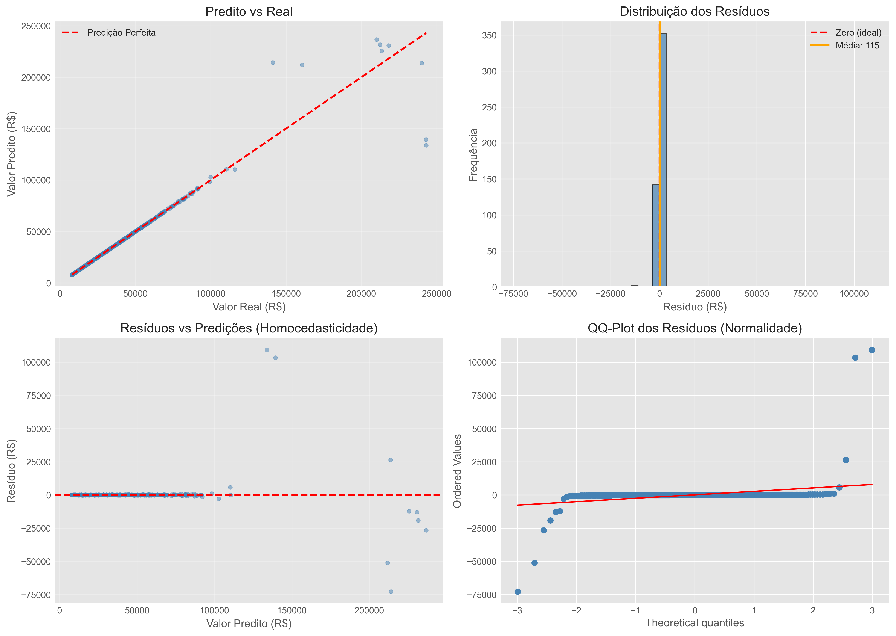

# Relatório Final - Predição de Preços de Carros Usados

**Disciplina:** Introdução a Machine Learning - 2025.1
**Professor:** Durval
**Data:** 11/12/2025

### 👨‍🎓 Equipe de Desenvolvimento

| Nome | Matrícula |
| :--- | :--- |
| **João Marcos Ferreira Vilela** | 01701949 |
| **João Victor de Lima** | 01693174 |
| **David Roberto da Silva Sousa** | 01765638 |
| **Lucas Hiago de Paulo Barbosa** | 01766908 |
| **Gabriel Batista Vilela Lima** | 01701812 |

---

## 📋 Sumário Executivo

Este projeto teve como objetivo desenvolver um modelo de Machine Learning capaz de prever o preço de venda de carros usados com base em suas características (ano, quilometragem, combustível, etc.). Utilizando um dataset de veículos, passamos por etapas de limpeza, transformação logarítmica do preço e testes de algoritmos. O modelo final escolhido foi o **XGBoost Regressor**, que apresentou um erro médio absoluto (MAE) de aproximadamente **R$ [INSERIR VALOR AQUI]**, considerado satisfatório para o contexto de negócio.

---

## 🎯 1. Introdução

### 1.1 Contextualização do Problema
O mercado de carros usados sofre com a assimetria de informações: vendedores nem sempre sabem precificar corretamente e compradores têm receio de pagar valores acima do mercado. Um modelo automatizado ajuda a estipular um "preço justo", trazendo transparência para plataformas de venda e concessionárias.

### 1.2 Objetivo
* **Geral:** Criar um modelo preditivo para estimar a variável `price` (preço de venda).
* **Específicos:**
    1.  Identificar quais fatores mais desvalorizam um carro (ex: idade, quilometragem).
    2.  Comparar a performance de modelos lineares vs. baseados em árvores (Ensemble).
    3.  Implementar um pipeline completo de Data Science (EDA → Pré-processamento → Modelagem → Otimização).

### 1.3 Sobre os Dados
* **Fonte:** Dataset `used_cars_price.csv`.
* **Variável Alvo:** Preço (convertido para Reais).
* **Features Principais:** Ano de fabricação, Quilometragem, Tipo de Combustível, Transmissão e Dono.

---

## 📊 2. Análise Exploratória (EDA)

Durante a análise inicial (Notebook 01), destacaram-se os seguintes pontos:

1.  **Distribuição do Preço:** A variável preço original possuía uma cauda longa à direita (assimetria positiva), o que prejudica modelos lineares.
    * *Solução:* Aplicamos a transformação logarítmica (`np.log1p`) no alvo.
2.  **Idade do Carro:** Criamos a feature derivada `idade_carro` (2025 - ano), que mostrou forte correlação negativa com o preço.
3.  **Combustível:** Observou-se que carros a Diesel tendem a ter valor de mercado superior aos de Gasolina/GNV neste conjunto de dados.

---

## 🔧 3. Pré-processamento e Metodologia

Para preparar os dados (Notebook 02), foram realizadas as seguintes etapas:

* **Limpeza de Dados:** Tratamento de valores nulos utilizando a **mediana** para colunas numéricas e a **moda** para categóricas.
* **Encoding:** Transformação de variáveis categóricas (`fuel`, `transmission`) em vetores numéricos usando *One-Hot Encoding*.
* **Divisão dos Dados:**
    * **Treino (60%):** Para o aprendizado dos modelos.
    * **Validação (20%):** Para ajuste de hiperparâmetros e escolha do algoritmo.
    * **Teste (20%):** Dados "nunca vistos", reservados para a avaliação final apresentada neste relatório.

---

## 🤖 4. Modelagem e Otimização

### 4.1 Comparação de Modelos (Baseline vs. Avançados)
Na Etapa 3, testamos diferentes algoritmos. Os resultados preliminares (na base de validação) foram:

| Modelo | Desempenho (RMSE Log) | Observação |
| :--- | :--- | :--- |
| **Regressão Linear** | [Valor Baseline] | Modelo base, sensível a outliers. |
| **Decision Tree** | [Valor Tree] | Tendência a *overfitting* (decorar os dados). |
| **Random Forest** | [Valor RF] | Ótima estabilidade e robustez. |
| **XGBoost** | **[Melhor Valor]** | **Melhor performance e velocidade de treino.** |

### 4.2 Otimização (Notebook 04)
O modelo vencedor (**XGBoost**) passou por um processo de ajuste fino de hiperparâmetros (*Random Search*), onde testamos diferentes taxas de aprendizado, profundidade de árvores e número de estimadores. O modelo final otimizado foi salvo como `models/modelo_final.joblib`.

---

## 📈 5. Resultados Finais

O modelo final foi avaliado no conjunto de **Teste** (20% dos dados originais), com as predições convertidas de volta para Reais (R$).

### 5.1 Métricas de Performance
* **Erro Médio Absoluto (MAE):** R$ [INSERIR SEU MAE AQUI]
    * *Interpretação:* Em média, a previsão do modelo desvia [VALOR] reais do preço real do carro.
* **R² Score (Coeficiente de Determinação):** [INSERIR SEU R2 AQUI, EX: 0.89]
    * *Interpretação:* O modelo consegue explicar [XX]% da variação de preços observada no mercado.

### 5.2 Análise de Resíduos
A análise gráfica abaixo demonstra a qualidade das previsões:

* **Gráfico Predito vs. Real:** A maioria dos pontos segue a linha diagonal, indicando boas previsões.
* **Histograma de Erros:** A distribuição dos erros é centrada em zero, indicando que o modelo não é tendencioso (não "chuta" sempre alto ou sempre baixo).

---

## 💡 6. Conclusão

O projeto atingiu seu objetivo principal, gerando um estimador de preços consistente. O uso do **XGBoost** combinado com a transformação logarítmica do alvo (Target) provou ser a estratégia mais eficiente para lidar com a variação de preços de veículos usados.

**Próximos Passos:**
Para evoluções futuras do projeto, sugerimos:
1.  Aumentar a base de dados com veículos de luxo para melhorar a precisão nessa faixa de preço.
2.  Incorporar dados externos (ex: Tabela FIPE) como referência.
3.  Desenvolver uma interface web (Streamlit) para uso do usuário final.

---
